# Market Event Feeds — E2E Sequence

This diagram shows how listing and sale activity moves from Magic Eden into the local append-only feed and then into the Grid-only right-side market panel.

```mermaid
sequenceDiagram
    autonumber
    participant User
    participant FE as Frontend<br/>MarketExplorer.svelte
    participant API as Backend<br/>GET /market/events
    participant Repo as Backend Repo<br/>loadMarketEvents
    participant DB as SQLite<br/>market_events + tokens
    participant Worker as Worker Loop
    participant Events as Worker<br/>syncMarketEvents
    participant Fetcher as Worker Fetcher<br/>activities API
    participant ME as Magic Eden<br/>/activities

    rect rgb(89, 106, 109)
        Note over Worker,ME: Indexing path, runs after the normal listings snapshot sync each worker cycle
        Worker->>Events: syncMarketEvents()
        loop event_type in listing, sale
            Events->>DB: ensureMarketEventSyncState(event_type)
            DB-->>Events: backfill_offset, backfill_complete

            loop recent pages
                Events->>Fetcher: fetchMarketEventsPage(event_type, offset)
                Fetcher->>ME: GET /v2/collections/drifella_iii/activities<br/>?type=list|buyNow&offset&limit=100
                ME-->>Fetcher: activity rows
                Fetcher->>Fetcher: normalizeMarketEvent()<br/>tokenMint, signature, source, slot,<br/>blockTime, seller, buyer, image
                Note over Fetcher: Numeric SOL price is converted<br/>to 9-decimal integer base units.
                Fetcher-->>Events: normalized events + skipped count
                Events->>DB: INSERT OR IGNORE market_events
                Note over Events,DB: Idempotent key:<br/>(event_type, signature, token_mint_addr)
                DB-->>Events: inserted count
            end

            alt historical backfill incomplete
                loop bounded backfill pages
                    Events->>Fetcher: fetchMarketEventsPage(event_type, backfill_offset)
                    Fetcher->>ME: GET /activities?type=list|buyNow&offset=backfill_offset
                    ME-->>Fetcher: activity rows
                    Fetcher-->>Events: normalized events + raw page count
                    Events->>DB: INSERT OR IGNORE market_events

                    alt page has limit rows
                        Events->>DB: update backfill_offset += 100
                    else short page
                        Events->>DB: mark backfill_complete = 1
                    end
                end
            else historical backfill complete
                Events-->>Worker: recent sampling only
            end

            Events-->>Worker: summary for worker.log
        end
    end

    rect rgb(65, 49, 65)
        Note over User,DB: Read path, triggered from Grid via sales/listings status-bar buttons
        User->>FE: Click sales or listings
        FE->>FE: open right side-panel<br/>mode=sale|listing
        FE->>API: fetchMarketEvents(type=sale|listing, offset=0, limit=50)
        API->>API: clamp type/offset/limit
        API->>Repo: loadMarketEvents(type, offset, limit)
        Repo->>DB: SELECT count + newest-first rows<br/>LEFT JOIN tokens by token_mint_addr
        DB-->>Repo: events enriched with token_num,<br/>token_name, image fallback
        Repo-->>API: total, offset, limit, items
        API-->>FE: JSON feed response
        FE->>FE: render compact rows:<br/>relative time, 540h preview,<br/>price SOL • #token • owner flow

        opt user scrolls near feed bottom
            User->>FE: Scroll feed
            FE->>API: fetchMarketEvents(type, offset=items.length, limit=50)
            API->>Repo: loadMarketEvents(type, offset, limit)
            Repo->>DB: SELECT next page
            DB-->>Repo: event rows
            API-->>FE: JSON feed response
            FE->>FE: append rows
        end

        opt user switches feed mode
            User->>FE: Click sales or listings
            FE->>FE: reset items and offset
            FE->>API: fetchMarketEvents(new_type, offset=0, limit=50)
            API->>Repo: loadMarketEvents(new_type, 0, 50)
            Repo->>DB: SELECT filtered newest-first rows
            DB-->>Repo: event rows
            API-->>FE: JSON feed response
            FE->>FE: replace rendered feed
        end

        opt user opens token from event
            User->>FE: Click preview or #token
            FE->>FE: close market panel
            FE->>FE: navigate to Gallery centered on token mint
        end
    end
```

Key properties:

- Listing snapshots remain versioned and atomically flipped; market events are independent append-only facts.
- The worker samples recent activity pages every cycle so new events appear without waiting for full historical backfill.
- Historical backfill is bounded per cycle by `DRIFELLASCAPE_MARKET_EVENT_BACKFILL_PAGES`.
- The backend reads are short SQLite transactions and never touch the in-memory listings cache.
- The frontend market feed is Grid-only; opening a token from a row closes the side-panel and enters Gallery centered on that mint.
- The frontend market feed uses the shared API helper, so the existing network activity dot reflects feed loads.
